**CHAPTER 1 	INTRODUCTION**

**Background:**

`     `At the very basic level by computation we mean calculations and obtaining some output from some set of input fields. By the term, one can also say that we can consider subtractions, additions, multiplications and divisions, the basic mathematic operations and later on all of the advanced mathematics which actually is a mixture of these and some other basic operations. Using modern technology for the purpose of information processing is also said to be as a type of computation. We can classify computation generally by three unique criteria: digital versus analog, sequential versus parallel versus concurrent, batch versus interactive. Computations if we see at the basic level is involved up to some extent to every person in the world, so handling this was very big obstacle and hurdle at times when people don’t have the facility of computers. 

`  `**1.1.2 The Era of Computation before Computers**

`      `In the earlier times of 20th or before 20th century people were doing calculations by themselves, and were having self-working ability with respect to calculations.[WIKI] The very first helping tool that arrived in helping the humans to do digital calculations was a mechanical machine known as “Calculating Machine” at that time, and know very informally known as “Calculators”. The earlier machines were all mechanically adjusted and were purely doing the job by setting the values manually and later to get the result.  

`  `**1.1.3 Evolution of Computers**

`      `Later on with the arrival of computers and computing devices sincerely resolved the problems of people who want to do calculations. These then came to make people benefitted by the way that calculations become easier. The basic arrival of computers and computing technologies came in to market with the real arrival and invention of transistors and integrated circuits. [WIKI] At first the computation by humans was replaced by analogue computing devices, but later on with the ubiquitous arrival of transistors and IC’s (integrated circuits) by then replaced by digital computing devices. These devices were of different style, design and technique and increased the stack of their functionalities with time and congestion of more development of the devices used to make up the computers. This resulted in the decrease prices of computing devices with decrease in the rates of devices used up to make computers. Now with the passage of time computers introduced more personally to the people in the likes of PC’s (Personal Computers), Smart Phones and tablets.   

Strategic development in the field of Computers

` `Now with the increase in computing environment all over the world and growing educational motivation all over with highly increased reputation of educational institutes, computers and computing devices have become immense requirement of people. In the last three decades of 20th century computer engineers and scientists with the education providers of that time strategically organized the real platform for the successive adoption and maintenance of computing devices. They also boosted these devices with time to time more opportunities and functionalities. With the majestic flavor of integration and differentiation concept of mathematics, miniaturization from every aspect was achieved in these devices.   

`  `**1.1.3 Usability of Computers**

`       `Later on in the 20th century making successive usage of these devices was sincerely considered as big achievement. IT (Information Technology) specialists and more educationists of that time were the real users of computing devices of that time. Later on with sensible marketing approaches of big corporates responsible for designing these devices, computers from super computers reached the destiny of PC’s (Personal Computers). Now the focus of these corporates have diverted more to normal human of daily life. Two big achievements of that time were: first introducing normal human with the hardware structure of computers up to the concerns of functionalities and operations they are used for. Second was that every computing device with hardware structure, was also loaded with side by side software programs.

`   `**1.1.4 Interaction with Computers**

`      `For complete interaction with computers in order to gain high contrast, user must have good interaction habits with the computer devices both in the manners of hardware devices for I/O (Input/Output) and software programs (Operating System) running. For a naïve user it interaction by self was a big challenge of that time, and still it is very disgusting. It’s the responsibility greater on the system hardware and software designers. At the earlier times of computers and computing technologies, engineers and computer designing corporates were facing more problems in the sense of hardware interaction, while deploying to naive users. This was due to two reasons: one is that computer structure was completely first time ever seen thing for the users, as never saw even a device in similar look to computers. Second was that, software was not as much complex as it is now, because only limited functionalities were part of that software. Later with the passage of time, arrival of many other functional digital devices in the form of TV (Television) sets, refrigerators, and many other embedded systems, people have gone through the first time interaction hurdle. Now hardware interaction problems are not as stickier as of software interaction problems. 

` `In this article we are discussing the software design challenges and our main focus will be on the people less or even no education level. We’ll go through some very passionate testing modules and then suggesting design principles specifically for people having little or nil literacy.         

`  `**1.1.5 An Introduction to Illiteracy**

`    `Generally by illiteracy we mean the inability to read and write. The term literacy is taken in different manners, at the very basic level it is taken as the ability to read and write, but it is now expanded to the ability to use language, numbers, images and symbols to understand. [WIKI] In OCED (Organization for Economic Co-operation and Development) countries the meaning of the term literacy has expanded to include skills to access knowledge through technology and an ability to assess complex contexts. There are basically three kinds of illiteracy, these include: Functional Illiteracy, Cultural Illiteracy and Moral Illiteracy.

` `The United States Department of Education claims the functional illiteracy, as failure of doing such basic tasks like reading, writing and mathematics covers almost 24 million Americans. Thirteen percent of the seventeen year old Americans are illiterates. [Time]

` `Now even if someone able to attain degree of functional literacy, even still it suffers from problems of understanding like cultural literacy. According to E.D. Hirsch, Jr., the author of *Cultural Illiteracy:* "To be culturally literate is to possess the basic information needed to thrive in the modern world."  [1]

**1.2 Illiteracy VS Technology**

`  `On one side technology striving towards every aspect of life and facilitating everyone in the world. But on the other side this facilitation is for a limited amount of people only for those who are literates. Even functional literates could not interact successfully with the technology. Currently the design interfaces for interaction in technology are only for literates, so for making successive interaction of illiterates with technology to get facilitated we should apply those design principals which should produce interactive designs for illiterates. As we discussed earlier, that problems during interaction at the hardware level were most of the time concern of engineers and computing devices designers, but software interaction is becoming even more risky and disgusting with the passage of time.

`  `There have been many approaches by the hardware and software designers at every running time, mostly at the starting time of computing technologies, main focus was on hardware adjustments and releasing the solutions for these. With the passage of time it has been almost covered for literate users. Then the focus gained by software design problems of interaction, and software designers and developers started approaching towards these problems. Here also the focus was on literate users and still it going on. As we get pass with the time, people became technology fan and more we say technology dependent at every aspect of life, so technology replaced the manpower at most of places. This resulted into such a state where one type of people have technology inspiration, but others even don’t able to interact for one single time. One group is considered so much that hardware designers facilitated them so much that they are been able to use computing device so much small even holding that in one hand, which was even taking place of one whole large room. Software designers have facilitated, them in a similar manner that using such large devices in past for only small calculations, and now hand held devices could provide them almost every facility. Software interaction is even considered under many parameters like time interval, speed, efficiency, privacy, and multitasking.

`  `Partial literates and complete illiterates have not remained the focus of technology providers most of the time, so that’s why they are away from the usage of modern software and hardware technologies. Some approaches towards facilitating the illiterates done by some scientist, but very less of them went on from their initial stages. These were most of the times towards health, agriculture and communication sectors. Many researchers, especially in the under-developing or developing countries, like India, Pakistan and some African countries. The focus was all the way on the above said sectors or related ones most of the time. The target of all these projects was not only facilitating illiterates with enormous flavors of technology, but also making them learn the technology interaction, just like the illiterates in the developed countries who can even able to have successive interaction up to some extent. 

1. **Role of ICT4D**     

`  `Information and technology for development (ICT4D), is actually a program of ICT, which is actually an extended program of IT (Information Technology), but it deals more with unified communications, more of telecommunications, also computers but taking enterprise level software, middleware storage and audio-visual systems. [WIKI] It is actually in the favor of communication of information between people but by using the services of technology or technological devices. Both the Telecommunication and Software sectors stood side by side, where communication media and miniaturization has been provided by telecom sector, and sender-receiver protocols and the software programs aligned by software sector. As a result, ICT confronted deficiencies by taking first ever time taking step in facilitating the illiterates, first by making them communicate with one another with the help of technology. 

`  `Now if we talk more of the favoritism with illiterates, the term ICT4D started recognizing itself, which actually refers to the usage of information and communication technologies (ICTs), while familiarizing and implementing them in the fields:  socioeconomic development, international development and human rights. The basic promo behind this concept is that to provide the society more communication facilities with better advancement to the society, so as for great chances of society development. [WIKI] Beside these, ICT4D also covers some criterion on basic education, healthcare, agriculture and community development. 

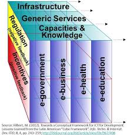

`  `(Fig 1.1 ICT4D cube)

`  `The given figure (Fig1.1), is representing ICT4D cube, that actually highlights the manifesto of ICT4D, where providing technologically enhancement in government, business, health and education sectors by simply utilizing what we currently have, we say capacities and knowledge, infrastructure and services, all along with dealing regulations and laws and achieving the targets by incentives. It recommends that ICT4D’s focus is exactly as mentioned earlier to achieve a set of targets in some greatly interactive departments, but by using the current resources all along with updating these and considering negativities that could either come later, and following the good reasons and experiences.  

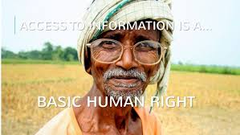

(Fig 1.2 ICT manifesto)

`  `The manifesto of ICT4D is just right at the exact time for people who are from either from under developed or developing countries, who very weak socially, morally and economically. ICT4D is focusing most of the time to these people, because the departments it is going to focus many times, are many times dependent upon these people, as they productive resource of these departments. As in figure (Fig 1.2), the manifesto is highlighted as, “Access to information is basic human right”, and it shows high dependency agriculture sector on illiterates, where for latest technologies adoption for better seed growth and exceed production percentage, farmers realize as agriculture related information access as their basic right. 

1. **Our Focus**    

`   `Continuing the manipulating concerns of ICT4D towards illiterates, we are going to register one other approach towards the facilitating and servicing illiterates, on a similar platform as of ICT4D. Our focus is also on both illiterates and functional illiterates, who can either completely cannot read write, or functionally literate to doing of some specific tasks. They aren’t have any access to technology or technological devices. They might have a little bit interaction with simple mobile phones up to only dialing of numbers or receiving of calls, and some even couldn’t do this one as well. They don’t have any kind of interaction with smart phones, tablets, PCs (personal computers), laptops, ATMs (automated teller machine), Internet services like email, voice and video chat, social networks etc. They even can’t interact with the embedded systems like the ones now coming with refrigerators, ACs (air conditioners), washing machines etc. Some of them only can the TV (television) sets on and off only and using remote for changing the channel is even disgusting activity for them. 

`   `For achieving our manifesto, we have suggested our target community holding all the capabilities we have already discussed earlier, from population from our own environment, in our own country, Pakistan. Our target population are the citizen of the KPK (Khyber Pakhtoon Khwa) province. We targeted two communities here, one who speak Pashto language and the other who speak Hindko language. Both females and males were considered at the same time, side by side. 

1. **Our Approach**  

`   `For every interactive systems designed now a days, almost every system is individualizing the user in the form of providing them user name or signatures and passwords to get uniquely login and logout with their system. This is not only a good practice for privacy purposes, but also suggests user feel excited about the system and makes them feel that they are only owning this specific part of system, commonly termed as User Profile. This is very common at Banks, online transactions, social networks and in many other private systems.

`  `Towards illiterates, first time an Indian researcher suggested an approach by using mnemonics technique. This was by an Indian researcher named Danish S.Katre [2] in his PhD research, suggested uniquely self-identification for village illiterates by mnemonic technique. His work was completely based on pictures and pictorial representation, and used finally suggested a bundle of seven pictures + one color, as user name and password, where he suggested first four of that pictures as unique user name or pictorial identity, and the rest of three pictures + one color as secret password or pictorial signature. 

`  `We are modifying the concept here in our work, by suggesting profile picture of the user, which should be taken with the help of front cameras in laptops, tablets and smart phones, as the unique identity of the user or user name. Actually we are not only approaching towards a self-identification system for illiterates like Danish S.Katre, so that if we suppose that an illiterate by self could remember his user name and password, which actually in that system was actually one set of pictures for an illiterate. In ours case some issues were on behalf: one that we are also doing profile building here and also putting for every user having unique identification with our system to have a facility of sending and receiving a recorded message, we say it as email message for illiterates, so for that anyone sending to somebody having account with us, but remembering his user name for justifying his/her identity with us, would become almost impossible here in this case. Second, making the user to understand first four as pictorial identity and the remaining as pictorial signature, would by self requires a great deal to understand for an illiterate. Third, user become confused with which four to show to others and which four to retain secret from everyone, so account privacy could even become non feasible challenge. Fourth, number of unique accounts would also be great challenge for us, so large number of picture adjustments would also at some point become impossible. 

`  `We are using captured picture as self-identity or unique user name and only a set of four pictures each one from one different frame of pictures so as to make large domain. Each frame was containing ten pictures, and actually from a set of unique forty pictures, user is going to select only four, in the manner as said earlier. This approach is feasible for any amount of users, but only some design principles could manage them all at one stage, in one system and in one time. We are first distributing the domain of our target population on the basis of some of their major differences, like speaking language (Hindko or Pashto), gender (male or female) and occupation. On the basis of these discriminations managing such a large number of users could also be possible. Later if we want to manage large number of users we can manage on these discriminations among these and the system later than could produce highly sophisticated properties like that of  popular servers like Google’s Gmail. 

`  `In the second part of our approach, we are making sense of being inside every user’s profile like that in current popular email servers, where user can do the following: can generate an email (Voice Message) and send that to anyone from the given set of users by the system, and can also read incoming emails (Listen Voice Messages) and can also delete those incoming messages. User can also log out from the account, as we have in other servers. This approach is of an asynchronous type, just like a postmen who hold a letter from one person to other. A team of Indian and Canadian researchers took premises and suggested some work to provide this typical asynchronous communication between illiterates. Their approach was initially to provide multiple communication types like audio, video, text and inked (painting) messages, which later resulted in a more confusing one. Finally they have also taken user picture as his/her user name, and numerals as passwords, and retained with the only video capturing and sending instead of audio, text and inked. Users were almost confused with video capturing, as most of them got confused with this as direct peer to peer synchronous video communication. Log In system was also confusing as remembering of numbers for everyone. 

`  `Instead of their style of facilitating illiterates in this matter, we are approaching towards even with a different approach, and designed interfaces even in a more suitable way. Consistent help with respect to our approach is that to run help audios at the background of each interface. We found this one easier. User names are also profile pictures, but here in reality we are building profiles, by taking language, gender and occupation information. For the sake of simplicity at the very basic and initial stages of technology interaction of illiterates we have just provided audio message recording and sending to someone having account with our system.  

**1.6 References:** 

1) [http://www.reformed.org/webfiles/antithesis/index.html?mainframe=/webfiles/antithesis/v1n5/ant_v1n5_illiteracy.html \[1](http://www.reformed.org/webfiles/antithesis/index.html?mainframe=/webfiles/antithesis/v1n5/ant_v1n5_illiteracy.html%20%5b1)]

1) Mnemonic Techniques for Self Identification for Illiterates By Dinesh S Katre:

1) Exploring the Feasibility of Video Mail for Illiterate Users by Archana Prasad1, Indrani Medhi1, Kentaro Toyama1, Ravin Balakrishnan2

` `**Chapter 2                              Literature Review**

As we have already mentioned that we are facing two problems regarding this issue. First one is the self-identification while second one is the email application. Currently there are a large number of illiterates in the world and for them is a very difficult task to remember the login names and passwords, so it is needed to make them understand and learn the things. User needs to set up his account (1). In future, he needs to identify himself uniquely and remember his identification. Graphics were preferred over text for identification. Consistent help for setting up the account and for future use is required. Welcome message has got a good effect on users. Users were divided into certain categories like literate, semi-literate etc. numeration idea for illiterates was also proposed. Users preferred video mailing instead of others. Abrupt page changes made the user fed up. Instead it should be animated/slow. Picture quality should be high and size and position on the screen does matter. Many users remembers digits by their specific shape and constant position. Precise instructions were preferred instead of a length one. Mnemonics Technique (2) was tested on villagers & 2000 were the subjects. Subjects took pictures according to their fields and knowledge. 6 pictures and 1 color scheme was taken as identification. 9 picture per screen were used. After selection of pictures, make them remember to the user by telling him/her the sequence. Specific location and size does matter for selection of pictures. Pictures with simple backgrounds were preferred. The gender base choice of pictures need to be addressed.

**2.1 Problems with Illiterates:**

Making illiterates interact with the technology is a big problem. When we make these rural people in interaction to computers, unfortunately most of them were even not knowing the purpose of this machine and were having wrong expectations about the computers (3). This interaction of the users with the kiosk was analyzed from the four perspectives. These are motivation, interface, content and media. These people need some motivation to interact with computers, because they were hesitating while using the computer. The interface was quite difficult for these, because they were looking that for the first time. Visual interface, navigation and mouse interaction was problematic for them. Video was seen as a television video, animations were seen as unrealistic and texts were also creating difficulty for them. The users interacted with the kiosks and become confident then to use kiosks but after some days when they come again to interact that become again diminishing because they are not knowing their passwords end user names. So there is needed to work upon this so that they not only could remember their user names and passwords but also they should use facilities like email through kiosks. A the end author concluded that there are many limitations still in the self-identification and interactive styling which should be covered up in order to make it more and more usable. 

**2.2 ICT4D & Voice Based Techniques:**

This Paper (3) talks about the most recent intuitive difficulties for uneducated people while new portable and PC applications. Because of entry of new innovations to the creating nations, particularly ICT4D (Information and correspondence for improvement) both cell telephones and PCs serving the populace in creating nations too. The writer talks about the work officially done in the past for giving ignorant people UIs. In those interfaces realistic hand tailored representations were discovered more reasonable by the ignorant people when contrasted with the one uses pictures. Voice based help and the utilization of devoted catches and menus is likewise useful for ignorant people to comprehend the undertaking they are searching for. The creator examines that it is the main UIs additionally have had some different issues like estimating, associate learning and social standing which intercede how a client connects with figuring advancements when all is said in done. Alongside these, the creator examines some different issues other than the conventional issues with the UIs for unskilled people. The creator beforehand had done some work in the field of employment hunt, wellbeing data and portable cash exchange so the convenience considers that were not secured in those now will be secured. Our objective populace are practically ignorant people or semi-unskilled people. 

Subbiah Arunachalam's paper (4) is concentrating on the ICT, data and correspondence of innovation, which is for the purpose of new improvement and work to enhance the way of life of the individuals on the planet. The creator is stating that frequently associations and giving organizations get to be adhered keeping in mind the end goal to contribute cash for the improvement of individuals. They need to make their venture more advantageous for the focused on group, so for that they here and there want to put resources into giving these individuals sustenance and safe house rather to utilize it for ICT advancements. The essayist says that the decision is not either or, but rather if contributed wisely and creatively results to give great yields. The creator underlines on the improvement on the ICT based undertakings, and need to demonstrate some yield in result. In the event that ICT based activities doesn't demonstrate any fulfilled results and yields then it turns out to be more hard to legitimize the work. Regularly a greater amount of the attention is on the improvement side so as the outcomes were not as accomplished as was normal.

**2.3 Interactive Design Challenges:**

Work about the intuitive outline difficulties confronted by the individuals who have issue in perusing and goes through numerous troubles has additionally been done (5). As per creator individuals utilizing innovation are confronting numerous issues now a days. Exceptionally the individuals who can't read and compose. This is because of numerous intuitive and psychological configuration difficulties confronted by the populace of low education and terrible engine aptitudes. The creator is proposing the discourse  empowered system to help the intuitive client. 

Shaik. N. Meera, Anita Jhamtani, and D.U.M. Rao (6) considered for the data and correspondence innovation in horticultural advancement. The undertakings considered here differ as per the earth and the kind of individuals collaborated with, so it is truly vital to consider the objective group. Moreover these were additionally under the agreement of ICT in India, so meeting expectations of ICT is really viewed as and the then the scope of ICT is later on measured and looked at. These three of them were to give diverse functionalities as characterized in their objective sets, similar to the area records keeping up, agriculturist's information, online enrollment, inquiry answer administrations, most recent showcasing administrations, climate determining, last best bundles, most recent innovation, data costs and administration, early dangers and maladies, general horticulture data, dairying and drain, bookkeeping and installments, soil tests, poultry and creature minding administrations, most recent in business little organizations and rancher minding. These all offices were installed in the majority of the three undertakings just in agreement to their surroundings and system. These were the genuine objectives of these undertakings to accomplish. All things considered, we in this paper consider these three papers in respect to these parameters and afterward the working of ICT and the reaction to that work. We give the statics of our examination and work in this paper in the later part.

**2.4 Famers Problem & Solution:**

P. Krishna Reddy\* and R. Ankaiah (7) propose the framework that is relevant to each point of view of work that is vocation administrations will be given to the country group of the Indian horticulture area through innovation administrations. AgrIDs is a framework that is straightforwardly identified with ranchers and gives the substantial data to the agribusiness specialists to give them the administrations they are searching for. AgrIDs, since troublesome for ranchers to utilize, so in the middle of individuals are utilized which at any rate have a learning about utilizing the PCs and cellular telephones or may be having information about the fundamentals of innovation. In this framework agriculturists will utilize the framework with the help from the individuals named as facilitators who can connect with framework through web and then again agribusiness master ready to communicate specifically with the framework so keeping in mind the end goal to explain the issues identified with the ranchers. 

In an-another paper (8) the creator talks about the outline approaches and the challenges in outlining the interfaces for the ignorant clients all around the globe. The URSULA is really a venture that is really a rule situated for designers of sites and different applications for uneducated people particularly, all around and needs the engineers to deal with unskilled people and their understanding capacities. The creator later on highlights the working gadgets in creating nations like India, and the gadgets like Simputer, so it would turn out to be simple for the engineers to judge the objective clients.

**2.5 Usable Design Approaches:**

(HUDS) Hypothetical User outline situations, an outlining apparatus where originator determines the potential client of the framework with an itemized data about the application need and the specific arrangement of ecological calculates contact to the client communication. At that point the creator gets the data about any individual or any kind of association in the middle of the communication of client and the interface. At that point the creator composes the scripts of configuration as indicated by his comprehension of the situation. Later on originator notes down the issues that if could emerge in connection and recommends the arrangements and also the examination questions for making the plan more powerful. 

Client Interface Recommendations Supporting Universal Literacy Accessibility (URSULA) is an undertaking to make client interface rules for engineers who are composing applications and sites that may be utilized by uneducated clients. Specifically, these Guidelines would be helpful for engineers of gadgets for creating groups, for example, the Simputer, a little Information access gadget to be appropriated in India. In view of low proficiency levels among the objective populace for this gadget and the differences of dialects utilized all through India, extraordinary thought must be practiced when planning applications such that they are justifiable by clients who need composed dialect education. Interfaces that utilization discourse and dialog communication, 

Show non-phonetic illustrations, adjust to the proficiency level of the client, and acknowledge include by receiver and touch screen would be Well-suited to the area. This paper follows the introductory phases of URSULA work, and it exhibits how a reasonable interface configuration approach, Hypothetical User Design Scenarios (HUDS), can be utilized to drive the outline process.

**2.6 Work Regarding Email Application:**

Work about email application for unskilled people has additionally been finished. (1) User needs to set up his/her record. In future, he needs to recognize himself remarkably and recollect his ID. Representation were favored over content for ID. Reliable help for setting up the record and for future utilization is needed. Welcome message has got a decent impact on clients. Clients were partitioned into specific classes like proficient, semi-educated and so on numeration thought for ignorant people was likewise proposed. Clients favored feature mailing rather than others. Unexpected page changes made the client sustained up. Rather it ought to be energized/moderate. Picture quality ought to be high and size and position on the screen does make a difference. Numerous clients recollects digits by their particular shape and consistent position. Exact guidelines were favored rather than a length one. 

**2.7 Mobile Computing Approach:**

Joy Bose, Dipin K. P (9) proposed an answer for a versatile registering gadget alongside supporting base for the needs of uneducated clients in country ranges. They considered a method for changing portable applications which are Applicable in the field of health awareness, instruction, horticulture, NGOs activities, and offices like maps, open transport and government enlistment. The proposed arrangements are: 

=>	 Image/liveliness driven interfaces; Subject + verb + object. Pictures are put away against these activities in the database. Framework will build the sentence by the mix of important pictures (Artificial Intelligent System). 

- `	`Speech/Voice Driven Interface. The discourse acknowledgment programming will  hear the voice, parse it and develop the sentence in light of what it has heard.(NLP framework) 

=> 	Hybrid framework (picture + oral + activity + inquiry based). On the client choice, the framework will ask some applicable inquiries which can be replied in a solitary word. On the premise of the answer it will build the sen

**2.8 Web Browser for illiterates:**

They additionally presented a method for searching for uneducated people. At whatever point any specific bit of the page is chosen it ought to begin perusing that substance and upon the experience of the hyperlink it ought to quit perusing and stand out enough to be noticed to the hyperlink. Another methodology that they (9) proposed was the content free program that ought to incorporate some important labels about sound and feature/pictures and on the premise of yes/no dialog box client can connect with that.

**2.9 Use of Icons:**

This paper (10) locations both the utilization of symbols in supporting advanced substance route and their part in platform restricted perusing aptitudes when getting to computerized substance. They show a reasonable inclination of the clients towards photographs, however this inclination does not mean, in the same degree, higher coherence. The higher believability of photographic pictures could come about because of the way that photographs hold a physical connection with this present reality, as in they indicate genuine specialists, genuine records et cetera, then giving more validity to the representation.

**2.10 Combat Illiteracy:**

This paper (11) addresses the utilization of data and correspondences innovation, ICT or IT for curtness, to battle ignorance and to move uneducated people specifically from lack of education to PC proficiency. The methodology gives intelligent learning, self-managed and self-sufficient learning, stimulation learning, simplicity of data upgrading, simplicity of section and exit, and simplicity of utilization to E-Learning.. 

**2.11 eScreening Tool of Graphical User Interface:**

The eScreening device gives a graphical client interface with sound yields for clients who may be practically or PC ignorant. The interface is a Macromedia Flash motion picture demonstrated on a site. A database naturally and namelessly records the screening information. This paper (12) depicts our endeavors to outline and actualize the eScreening instrument. The yields are content and sound to suit perhaps unskilled patients. Graphical touch-up swill help make the interface look more expert and engaging. Additionally, upgrade of the sound segments will enhance the nature of the patient eScreening knowledge.

**2.12 Dialogue-based human-computer:**

To bolster human-PC dialog viably, architectures must bolster dynamic dialect understanding; that is, they must bolster the nearby combination of dialog arranging and execution with general errand arranging and execution. Dialog is a movement which includes the conversationalists' objectives and arrangements to accomplish those objectives 

Dialog-based human-PC (13) interfaces oblige dynamic architectures. Dialog obliges dynamic errand execution involves the necessity for what we call dynamic dialect understanding. Dynamic dialect comprehension is a perspective of realistic understanding which underlines the cozy relationship that dialect and dialog need to different sorts of action, including the perky way of dialect. On the off chance that dialog is a sort of assignment, and errand execution obliges an undertaking execution structural engineering that is dynamic, it takes after that the effective execution of dialog likewise obliges an undertaking execution building design. Likewise, a specialists takes part in dialog to help accomplish different objectives, not (normally) just to participate in dialog. Consequently, dialog errands must happen in the setting of different assignments (both semantic and non-etymological), sharing state, and additionally "intellectual" and physical assets.

**2.13 Graphical Reading Aids:**

In this paper (14) they displayed a method for building up a web program custom-made to the needs of practically ignorant individuals which is usable both for data recovery and learning. Our methodology centered both on utilizing systems of associating pictures and content and interface outline. The most essential method of showing graphical perusing guides for the members was the progressively demonstrated pictograms by moving the pen over, or indicating on the word. Alternate methods have been appraised positive however has not been utilized as broad as the alterably demonstrated picture.

**2.14 Speech and dialed input voice user interfaces:**

In this paper (15) they exhibit a study contrasting discourse and dialed data voice client interfaces for agriculturists in Gujarat, India. They ran a controlled, between-subjects explore different avenues regarding 45 members. They found that the errand fulfillment rates were essentially higher with dialed info, especially for subjects under age 30 and those with not exactly an eighth grade training. 

Because of the trouble and cost of giving preparing, an interface that is anything but difficult to learn and comprehend is a key outline thought for data administrations serving remote populaces. No clients communicated trouble in seeing how to work the framework through dialed information, including a few completely ignorant members. Be that as it may, one trouble with the DTMF interface was in transitioning between dialed inputs and talking, which was needed in the last assignment for recording the client's inquiry and individual data. A trouble crosswise over both modalities was exploring summon driven menus and knowing when to give info. Each talked brief was trailed by a beep to show that info was asked. The prompts did not unequivocally specify the beep, and numerous clients either gave include too soon or not in the slightest degree.

**2.15 Text Free User Interface:**

They portray work (16) around the objective of a client interface composed such that even learner, uneducated clients require truly no intercession from anybody at all to utilize. They fabricated two applications utilizing these standards, one for occupation look for residential workers, and another for a non specific guide that could be utilized for exploring a city. 

A noteworthy prerequisite that past work does not specify is the requirement for plenteous and reliably accessible help directions. As they discovered themselves rehashing the same foundation material and guidelines to our subjects every time we went to them, we believed that this material could be embodied into the application itself, and this expansion had a significant effect on the subjects' feeling of self-sufficiency. Indeed, even a solitary symbol missing voice annotation, for instance, causes perplexity, as subjects hope to have the capacity to indicate any graphical part and figure out what it speaks to. Additionally, help, in the event that it is made accessible, must be accessible constantly, or it will bring about a misfortune in certainty among subjects who have a tendency to be faulted themselves for the interface's inadequacies.

**2.16 Speech Recognition System:**

Discourse  acknowledgment  has  regularly  been  proposed as  a  key  to  general  access,  however  achievement  stories  of  discourse driven interfaces  for  uneducated  end  clients  will be  few  and  far  between. The difficulties  of  provincial  variety,  multilingualism,  social hindrances,  decision  of  proper  content, and,  most  imperatively, the  restrictive  cost  of  making  the  important  phonetic assets  for  compelling  discourse  acknowledgment  will be  unmanageable  utilizing conventional systems 

In  this  paper, (17)  they  examined  the  potential outcomes  for  a  discourse driven  UI  outline  for  clients  in  creating  districts  who  may have  never  been  presented  to  formal  instruction. They  proposed  a multi-modular  interface  that  requires  no  preparing  and  gives clients a mixture of visual and sound signals and data choices, permitting  each  client  the  adaptability  to  collaborate  with  the application to the best of their capacity and the framework's capacity. Members  esteemed  exactness  of  data  and  time  of communication,  which  found the middle value of  about  three  minutes. Members communicated  pride  and  fervor  at  listening to  a  PC  talk their  dialect.

**2.17 Audio Visual Representation:**

This paper (18) presents research leading toward an understanding of the optimal audio-visual representation for illustrating concepts for illiterate and semi-literate users of computers. 00 illiterate subjects each of 13 different health symptoms in one representation randomly selected among the following ten: text, static drawings, static photographs, hand-drawn animations, and video, each with and without Experimental Issues: A number of issues came up during the experiments which could have biased the results in one way or another.

Short-term category conditioning: if the first three symptoms presented in were headache, backache, sore throat, one after another, then the user was more likely to perceive the next symptom presented as an ache or pain of some sort. Test/text anxiety of subjects: Subjects who had some basic level of schooling exhibited significant nervousness when they were shown the text based version, as they seemed to feel the same pressures they may have faced in school.

**2.18 References**:

1) Exploring the Feasibility of Video Mail for Illiterate Users by Archana Prasad1, Indrani Medhi1, Kentaro Toyama1, Ravin Balakrishnan2
1) Mnemonic Techniques for Self Identification for Illiterates By Dinesh S Katre:
1) Designing for the Indian rural population: Interaction design challenges by Aditya Chand
1) Reaching the unreached: How can we use ICTs to empower the rural poor in the developing world through enhanced access to relevant information? By  Subbiah Arunachalam
1) Attuning speech-enabled interfaces to user and context for inclusive design: technology, methodology and practice by Mark A. Neerincx Æ Anita H. M. Cremers Æ Judith M. Kessens Æ David A. van Leeuwen Æ Khiet P. Truong
1) Information and communication technology in agricultural development: COMPARATIVE ANALYSIS OF THREE PROJECTS FROM INDIA by Shaik. N. Meera, Anita Jhamtani, and D.U.M. Rao 
1) A framework of information technology-based agriculture information dissemination system to improve crop productivity by P. Krishna Reddy\* and R. Ankaiah
1) Design Approaches for Developing User-Interfaces Accessible to Illiterate Users  
1) A solution for a mobile computing device along with supporting infrastructure for the needs of illiterate users in rural areas By Joy Bose, Dipin K. P
1) ICONS AS HELPERS IN THE INTERACTION OF ILLITERATE USERS WITH COMPUTERS By Ismael Mattos A. Ávila, Ricardo Ribeiro Gudwin
1) From Illiteracy to Computer Literacy: Teaching and Learning Using Information Technology By Mohamad Adnan Al-Alaoui
1) eScreening: Developing an Electronic Screening Tool for Rural  Primary Care By K. Doruk Akan, Sarah P. Farrell, Lisa M. Zerull, Irma H. Mahone, and Stephanie Guerlain, Senior Member, IEEE
1) Dialogue-based human-computer interfaces  and active language understanding By Will Fitzgerald, R. James Firby
1) An Approach to Help Functionally Illiterate People with Graphical Reading Aids By Marcel Goetze and Thomas Strothotte
1) A Comparative Study of Speech and Dialed Input Voice Interfaces in Rural India By Neil Patel, Sheetal Agarwal, Nitendra Rajput, Amit Nanavati, Paresh Dave, Tapan S. Parikh
1) Text-Free User Interfaces for Illiterate and Semi-Literate Users  By Indrani Medhi, Aman Sagar,  and Kentaro Toyama
1) SpeechRecognition for Illiterate  Access to Information and T echnology By Madelaine  Plauché, Udhyakumar  Nallasamy,  Joyojeet  Pal,  Chuck Wooters, Divya Ramachandran.
1) Optimal Audio-Visual Representations for Illiterate Users of Computers By Indrani Medhi, Archana Prasad, Kentaro Toyama

`  `**Chapter 3                               Methodology:**

As, we have mentioned about the problems of the illiterates interacting with computer. We have also proposed a solution to over-come the interactivity issue by developing an interactive email application for illiterates. 

After getting solution approaches research work done in the world. We gathered requirements from illiterates that what do they want from this. We asked them questions about self-identification. They proposed different solutions according to their own perspective. After gathering requirements, we developed a prototype and started working on that. The details of out method and proposed solution is given below. 

**3.1 Profile Building:**

First we started out profile building. On the first page the illiterates would be asked to select his/her language by clicking on a specific button (Fig 3.1) like Red for Hindko and Green for Pashto. Throughout the application there are voice instructions that tell the illiterate what to do. 

`                                                     `(Fig 3.1 Language Selection)

**3.2Language and Gender Selection:**

After selecting language, he will be asked to select his/her gender (Fig 3.2) in the much specified language that he selected before. All of the onward instructions are in that language.  

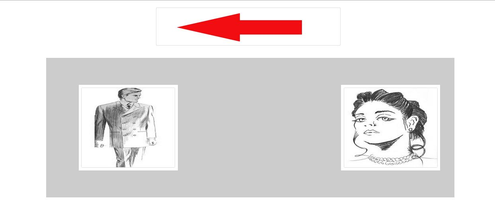

`                                                               `(Fig 3.2 Gender Selection )

When the subject selects the gender, the subject would be asked to select his/her profession. For males there are separate professions (Fig 3.3) and for female there are separate professions.

If the subject doesn’t find its profession in the specified list then he/she would be asked to select the profession that he could remember later for signing in.

This is what the subject’s profile has been created for signing in. All these values are saved about the subject now the subject would be asked “Does he/she has an account with our website?” In case of Yes, he/she would be asked to click on Green Tick Sign and in case of No he/she would be asked to click on Red Cross Sign (Fig 4). At every page, the subject has option to back on the previous page. At the end of every instruction, the subject would be asked that if he/she ever wanted to back to the previous page they could click on the red Red Arrow sign at Left corner of the page. 

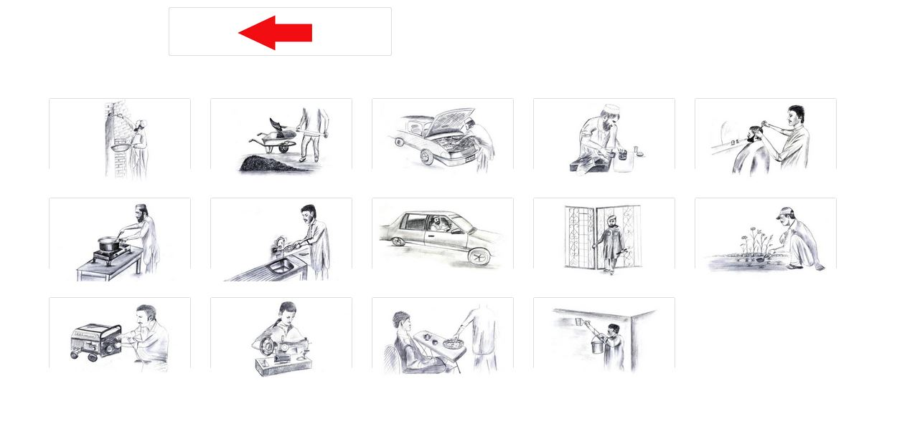
**
`                                            `(Fig 3.3 Profession Selection )

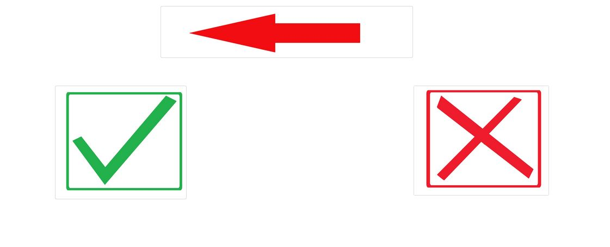
**
`                                              `(Fig 3.4 Account Selection )

**3.3 Account Sign Up & User Name:**

If the subject doesn’t has an account with us then he would click on the Red Cross and the the next page would be displayed. At this page, the subject would be asked to adjust camera for taking his/her picture that would be subject’s username (Fig 3.5). 

After taking picture by clicking on the camera icon, he has got the option to take picture again by clinking on the Red Cross sign or save picture by clicking on Green Tic sign (Fig 3.5.1). These all are voice instructions in the language that he/she has specified.

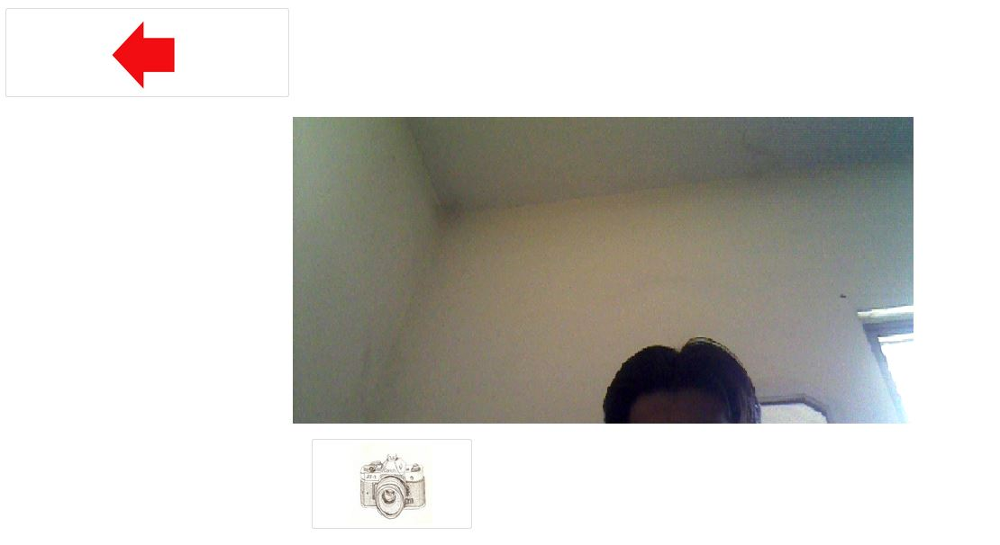

`                                                   `(Fig 3.5 Taking Picture )

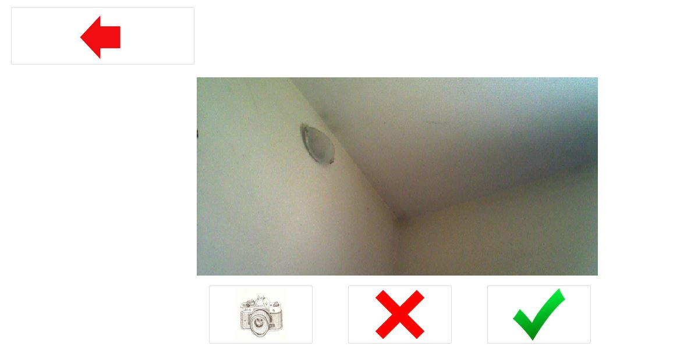 

`                                                 `(Fig 3.5.1 Confirm Picture )

**3.3.1 Password Selection:**

After that, he would be displayed with password selection page. Subject password would the combination of four pictures (Fig 3.6). At this page, instruction would tell the subject that he has to keep these pictures secret because with these selected pictures he can get signed into his/her account. During the selection of pictures, his/her selected pictures would be displayed on the top of the page (Fig 3.7) that he should have of clear concept of his selected pictures.

After the selection of pictures, he would be asked that could he remember those pictures for later password (Fig 3.8). If the subject doesn’t then he should go back and the subject then clicks on the Green Tic Sign below.

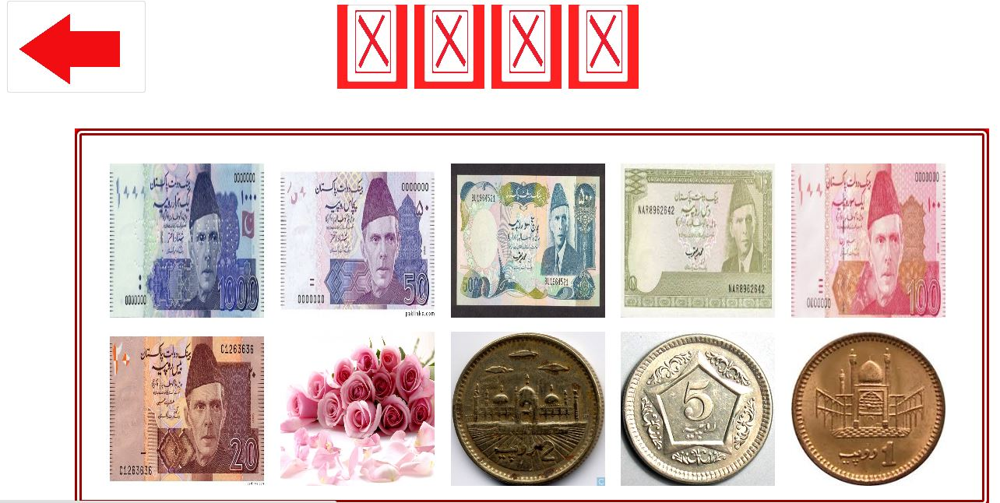

`                                                       `(Fig3. 6 Password Selection )

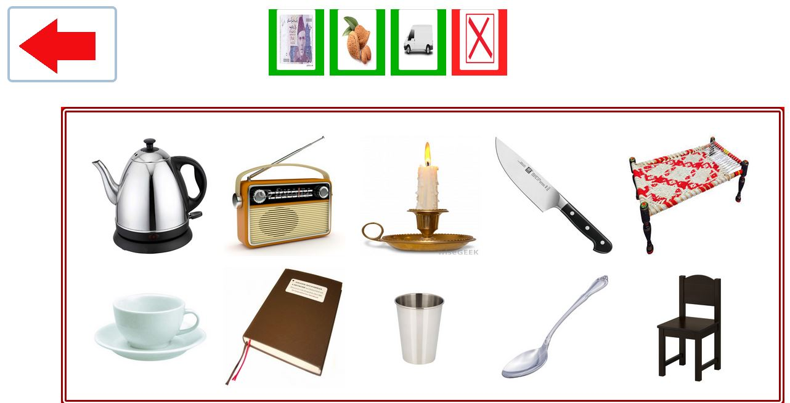
**
`                                         `(Fig 3.7 Showing Picture Combination)

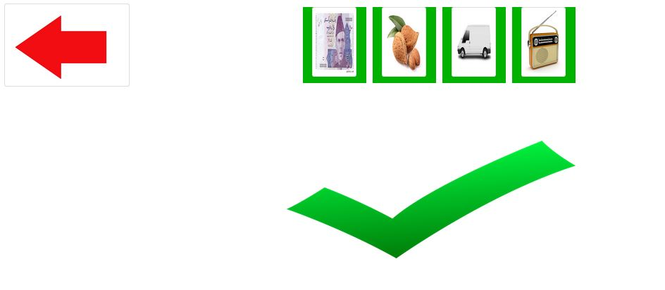

`                                                            `(Fig 3.8 Confirm For Login)

**3.4 Email Application:**

After clicking on tic sign he/she would go into his/her account. At this page, he would be welcomed then would be asked to do specific actions like he wants to record a message, click on the hand holding pen icon and he/she wants to listen the inbox message then clock on the very specified message like Red Color Box represent the new incoming message and Green color Box represent the old read message (Fig 3.9).

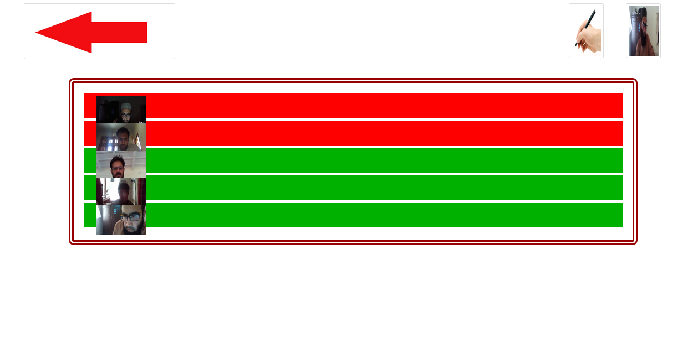

`                                                    `(Fig 3.9 Email Page)

` `If user clicks any of the box, he would be displayed with a page having icons of speaker and basket (Fig 3.10). For listening message, he would be asked to click on the Black Speaker and for deleting message click on the Basket icon. When the subject clicks on the basket icon he would be asked to click again for deleting permanently.

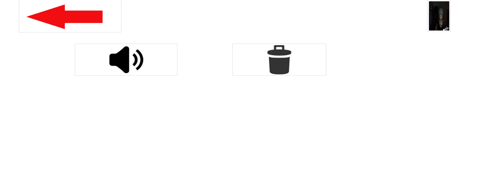

`                                                    `( Fig 3.10 Listen Recorded Message)

**3.5 Sending an Email:**

And the subject wants to record a message, he would be asked to click on the Hand Holding Pen icon and he would be displayed with pictures of other user whom the subject wants the message (Fig 3.11), 

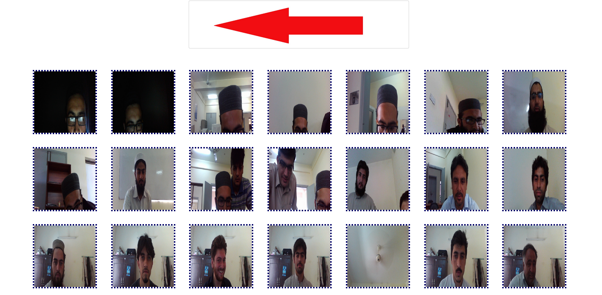

`                                                `(Fig 3.11 Person Selection)

after selecting any of the picture, he would be displayed with next page having icons of mike and stop button (Fig 3.12) . 

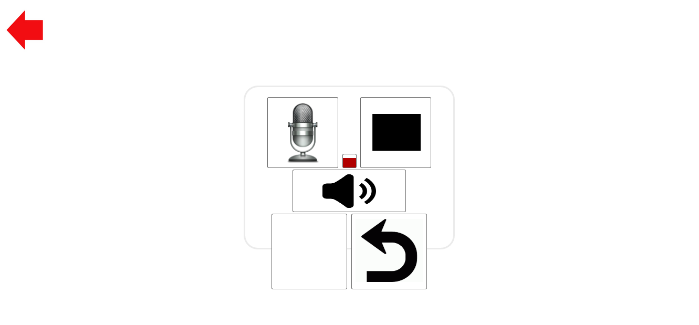

`                                                    `(Fig 3.12 Recording Message)

The instructions would tell the subject that he could record message by clicking on the mike button and he could stop that recording by clicking on the black rectangle button. When he stops recording he got an option of rerecording the message by clicking on the semi-circle Black Arrow icon or he could send that recording by click on the Lock icon as instruction has specified already (Fig 3.13). Then he could go back to his email page. He could get sign out by simply cling on the red arrow as instructions would specify him there. 

` `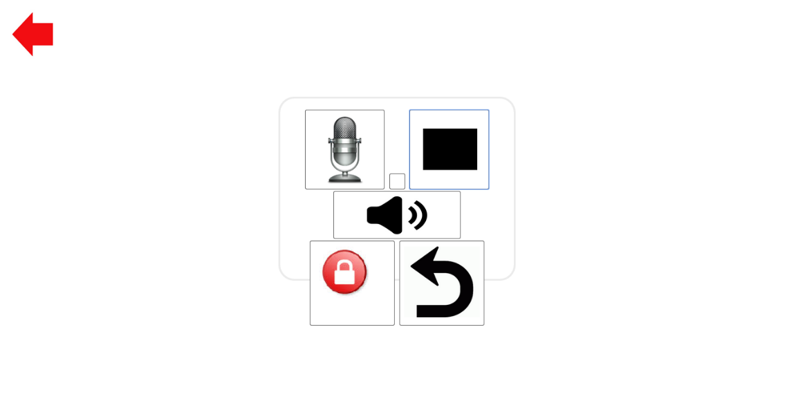

`                                                         `(Fig 3.13 Sending Message)

**3.6 Signing In:**

For sign in he would repeat the same step except clicking on the Red Cross he would click on the Green Tic (Fig 3.4). Then select his/her username and password (combination of pictures). Here the user would be asked to select those pictures that he already has selected for password and in case of wrong section he/she would be asked to select again.

**Chapter 4**                        **Data Collection and Testing**

After finalizing the application, we started collecting data. We tested our application on almost 180 people. Half of them were illiterates and half were literates. We made a table having many entities about illiterates like their interactivity with computer and mobile etc. their education and age. Time to use the whole application and their detail summary about how they used that application and what problems they faced.

Only a single subject used the application at a time so they could focus upon the steps. Some of the females were also out subjects. We observed every person like what mistakes he/she made? Where he/she became happy using that application? How many times does they listen the instructions? Which part was more usable to them?  Our main purpose was to find out that how an illiterate user uses this website if he/she is exposed to it without any training? How much does he learn from this program? Does he understand this email application by himself without third party help? Does he/she remember the password? Does he/she understand the purpose of password and email?

Above mentioned are all the things that we kept in mind for during testing analyzed on the basis of these points. Some of the results are given below in the subjects’ table and subjects’ summary report. That how did we observe them and those parameters that we kept in mind during the testing phase. 

**4.1 Subjects’ Table:**	

**Good:** They have used computer applications and mobiles. Already used email services.

**Fair:** They can only perform those limited tasks that someone has told them like play song etc.

**Nil:** They never even used computer or mobile.

|Subject  Name|Sex|Age |Education|Computer Interactivity|Mobile Interactivity(Smartphone )|` `Time (minutes)|
| - | - | - | - | - | - | - |
|Ahmed|m|23|Undergraduate|Good|Good|3.2|
|Waqas|m|24|Undergraduate|Good|Good|3.5|
|Shakir|m|27|Nil|Nil|Nil|7.1|
|inzamam|m|22|undergraduate|Good|Good|8.4|
|misbah|m|21|undergraduate|Good|Good|5.1|
|sohail|m|20|undergraduate|Good|Good|7.9|
|iftikhar|m|19|undergraduate|Good|Good|5.6|
|abbas|m|20|undergraduate|Good |Good|6.6|
|umar|m|24|undergraduate|Good|Good|4.2|
|Muraad|m|20|undergraduate|Good|Good|8.5|
|saffi|m|32|Nil|Nil|Nil|13.2|
|Habib|m|20|4th class|` `Nil|Nil|10.8|
|imdad ullah|m|20|undergraduate|fair|` `fair|16.1|
|kamran|m|23|undergraduate|Good|Good|9|
|` `mahdi|m|20|undergraduate|Good|Good|10.2|
|haseebullah|m|20|undergraduate|` `Good|Good|15.1|
|waqar ahmed|m|20|Undergraduate|Good|Good|8.2|
|najeeb ullah|m|20|undergraduate|Good |Good|6.6|
|naseer ahmed|m|21|undergraduate|Good|Good|8.8|
|` `obaid|m|20|undergraduate|Good|Good|7|
|nouman|m|22|matric|Nil|fair|6|
|shabir|m|28|matric|FAIR|FAIR|5.9|
|jamal|m|35|matric|` `Nil|` `Nil|6.4|
|ali|m|25|matric|Good|Good|6.1|
|saqib|m|40|masters|Nil|Good|8|
|zubaida|female|35|masters|Nil|Nil|7.7|
|` `salma|female|40|matric|Nil|Nil|9.4|
|navida|female|20|b.sc|Good|Good|5.1|
|yasir|m|30|Nil|Nil|Nil|8.5|
|matloob|m|40|Nil|Nil|Nil|4|
|hafez|m|30|Nil|Nil|Nil|7.1|
|shehla|female|23|undergraduate|Good|Good|6.3|
|waheed|m|40|Nil|Nil|Nil|9.1|
|hamza|m|19|f.sc|Good|Good|7.4|
|abdul qadeer|m|17|` `5th class|Nil|Nil|6.9|
|kamran|m|35|matiric|Nil|Nil|9.1|
|jannat gul|m|17|Nil|Nil|Nil|10.3|
|izaz|m|27|matric|Good|Good|6.6|
|shani|m|18|f.a|Nil|Nil|9.9|
|meer umer|m|30|5th|Nil|Nil|5.6|
|zain|m|17|maric|Good|Good|9.1|
|ihtesham|m|17|matric|Good|Good|5.8|
|munzar|m|35|Nil|Nil|Nil|7.3|
|asad|m|17|middle|Nil|Good|6.8|
|jafer|m|28|f.sc|Nil|Nil|7.9|
|sahid|m|40|f.a|Nil|Nil|8.8|
|muneer|m|19|Nil|Nil|Nil|7.1|
|sajjad|m|30|matric|Nil|fair|8.5|
|ubaid|m|25|matric|Nil|Nil|9.9|
|najeeb ullah|m|35|matric|Nil|Nil|8.5|
|naqeeb|m|32|matric|fair|Nil|10.8|
|azmat|m|30|matric|Good|Good|5.5|
|gulzada|m|40|Nil|Nil|Nil|7.8|
|nouman qureshi|m|20|b.sc|Good|Good|6.7|
|shehzad|m|19|f.sc|fair|` `fair|5.3|
|ahsan|m|24|` `m.a|Good|Good|8.7|
|ubaid urehman|m|17|matric|Good|Good|6.36|
|sajid|m|20|f.sc|Nil|Nil|9.22|
|sohrab|m|24|m.a|Good|Good|9.45|
|arifa|f|19|3rd |` `Nil|Nil|8.25|

**4.2 Subjects’ Observation:**

Misbah went smooth in starting pages. Listened instruction carefully, did according to the instruction as it is. He had Hurdle in getting picture for username a little bit. Selected password rapidly. Doing Good, doing sign in again. Didn’t send email just sign and sign out with his own intention?

Sohail is undergraduate student. Listened instruction very carefully, did as it is according to instructions. Listened thorough instructions. He did very rapid action against instructions. Went almost smoothly. He had hurdles in recording message first. He did well in second time and successfully sent the message. After doing everything he got himself sign out successfully.

Iftikhar went very smoothly as the instruction specified. He did action very rapidly as the instruction specified. He didn’t let the instruction to end but predicted everything right. He used to listened instruction half and did according to his own predictions and according to the specified instructions.  

Abbas did everything very Good and rapidly. He did everything according to the instruction as specified. He couldn’t send the mails because he couldn’t get the email page interface. He got himself sign out. He then went to sign in again and then recorded the message accurately. He did everything in hurry that’s why he was having hurdles at email page. When he listened instructions carefully then he was able to do everything very accurately and smoothly. The basic problem with this person was to listened instruction carefully. 

Umar did well with instructions. Pashto is not his native language but he did very well with that because of very instructions because he just learned Pashto. He listened everything very carefully, and did according to the instructions as specified. He got himself sing in very quickly.

Muraad did action on every instruction very quickly. At profession page he was having hurdles in selecting them. That’s why he listened that again and again. He couldn’t select the profession because he thought his own profession was not there so that’s why. He listened password creating instruction two time to get the whole idea and made himself clear. He didn’t select the password rapidly but with the way of remembering that. He did a very Good thing that he wrote the password with himself to make him remember for the next time. Then he went again smoothly. He sent message very smoothly after listening the instructions. He got himself sign out again.

Saffi was functional illiterate. He listened every instruction very carefully and did very Good. He was having hurdles in using computer mouse.  But he acted on every instruction very carefully. He was having. He went back and forth to listened instructions again and again. He was very happy when he saw camera picture in front of him. He needed training for doing. After two to three attempts. He did very well with the mouse that was an achievement. Every icon was self-explanatory for him. He was very happy using that application. He wanted to use again n again that account. He remembered the password clearly. He encourage other people specially illiterates to use that account. This was very usable interface for him and everything was clear the instructions as well as the the icons used.

Habib went back and  forth on the starting pages. He was having hurdles in using touch pad mouse. Then he made himself clear. He listened every instruction very clearly.  He made the same mistake as Saffi that he went to log in with signing up. He was asking for everything as he has provided with instruction. Once he get cleared the picture clear he went very smoothly. He was having troubles in selecting password. After recording the message he was having troubles in stopping the recorded message.  He could have done for better but he was confuse In front of me that’s why he couldn’t perform the best. But rather then that his performance was excellent for using the computer first time.

Imdad did well with instructions and icons. He did everything according to the instructions. At profession page, he listened everything again and again for that. He couldn’t select profession for himself he thought that he had none of them of his interest in here. Then he went smooth. He listened everything many times then acted upon any of the required action. Then he did very well with the password and action very accurately for every action. He listened each and every instruction at least two times. At email he was stuck again and listened instructions again and again. Then he got himself sign out according to his own understanding. Then he went to sign in again and he was successful in his first attempt. He was then going to send the message then recorded the messages then stopped successfully then he sent that message after listening the instruction many times. After that he again recorded the message again and sent the message.

Kamran did according to the instructions. He didn’t do anything wrong.  The thing he did that he captured this picture again and again until he was satisfied with his own picture. He forgot that what to do with the password then he went backward for selecting the password again and selected for himself. He was smooth throughout the application. He then successfully recorded the message and sent that message.

Ahmed and waqas were very Good at understanding the whole application. They understood each and every page very clearly and got the whole picture in their mind. They predicted each and everything very Good and went along the interface rapidly. They sent email and got themselves out of the application successfully.

Mahdi is undergraduate student. Pashto is not his native language but whatever he understood he did according to that. He took his picture again n again. He listened every instruction very carefully over and over again. He stopped on the picture remembering page and made himself remember with those pictures. Then went forward and successfully sent an email but after listening every instruction many times. Then he made himself clear with that.

Then Mahdi signed in himself very smoothly.

Haseeb ullah started listening every instruction again and again. He is also a undergraduate student. He logged himself in without signing in. he wanted to drag photos instead of clicking on them. Then he went back to sign up. Then he did well with signing up himself. Then he went back to set his password again because he couldn’t remember that combination that he selected. Then he sent a message to Mahdi. Then he got himself sign out again and logged in again and then sent another message. 

Waqar did very Good with the instructions. He went very smoothly. He listened every instruction fully and then acted upon the instruction. He didn’t need to go back and forth for instructions. He got himself stuck on email page. After over that he went smoothly to record message. He was the first one to re-record the message then he got himself log out. Waqar signed in again to listen messages very smoothly he listened all of the messages he received.

Najeeb ullah listened every instruction very carefully and didn’t repeat any of that. Then he went smoothly to sign up himself. He didn’t have any problem in recording and sending the message. He sent the message again. Then he sent a message to waqar. And got himself singed out.

Naseer started listening instructions very carefully. Then he went smoothly. After that he listened every instructed completely one time only and did action according to the instructions. He was having issues in stopping message. Then he finally overcame that issue and sent successfully. Then he again sent a message to Naseer ullah..

Obaid did well with instructions and went very well.  At many places he predicted an action and acted before the instructions because of the better usability design. He found it attractive to record the message and he was very happy with that. He sent a message to zafar very successfully. 

Nouman’s interactivity with computer is zero and he only uses mobile. But he listened every instruction carefully and do whatever was asked and got himself logged in. he said that design was so usable that he didn’t find any difficulty in going further into the application.

Jamal was a functional illiterate person. But he was happy to use this website. He followed every instruction and went very well. He gave a review that it’s a best application he used because he didn’t find any of the difficulty using this. His interactivity with computer was almost zero and he also didn’t use smartphone. And he completed the mail sending task in very less time. 

Shabir showed hesitation to use the application. Although he was a literate but he never used computer. His interactivity with computer was not very well. But he used the application very smoothly. He was having a little but problem in selecting password but he overcame that issue by himself and got himself logged in after creating his own profile. He successfully send the email and got himself signed out.

Saqib was a literate but he never used a computer. But he was exposed with the application, he went very smooth by following every instruction. He wanted to sign in first time instead of sign up but he overcame with that issue after listening the instructions and he got himself into the email page where he sent an email with any third party help.

Zubaida was very happy to use this application. She never used a computer but followed instruction very well and didn’t make mistake and went very well with the application. She successfully logged herself into the inbox and successfully sent an email. He took very less time for this. 

Salma listened every instruction very carefully. She never ever used computer before. She also never used a mobile. After first attempt, she became familiar with the mouse and went very well. She listened every instruction very carefully and repeatedly then did the appropriate action. 

Navida was educated. She used the application smoothly and easily. She got herself signed in after signing up. Then she stopped for a while and made herself remember her password. Then she successfully sent an email and got herself logged out.

Yasir was functional illiterate, he never used a computer or mobile. But he was exposed with the application, after 2 clicks of mouse, he became familiar with the application. he went very well then. He took his picture successfully. He accidently went to log in his account without creating an account, he he came back then and created an account. Then sent an email and logged out successfully.

Matloob was also a functional illiterate, and never used computer or a mobile. He started smoothly and went very smooth. Followed every instruction very carefully and did whatever was asked. He successfully created an account and was very happy to use that application but he didn’t send an email to anyone but instead got himself logged out.

Then he logged in again after some time remembered everything that he has selected before and got himself logged in successfully without making any mistake. Because the design was so usable and learnable. Then listened an email which has sent by his friend hafeez and was very happy to listen that. Then he logged out.

Hafeez was also in the category of functional illiterate people and started very smoothly. For some instructions he predicted as well and did act before listening the full instruction. Although he never used a computer or a touch mobile but he was very Good at this. He was doing everything very happily and successfully created an account without making any mistake. Then he sent an email to his friend matloob and then for himself signed out.

Waheed never used any sort of computer or mobile. He was also functional illiterate. He used the application smoothly and easily. He had a little bit problem at already account selection page and password selection page but overcame that problem by himself and did Good with that. Then he created his account and logged into that. After that he recorded a message and sent that to his friend hafeez successfully.

**4.3 Summary:**

Above described was our observation where we were testing on the subjects. We discussed some of the subjects in detail for the understanding of our observation. We described them to make a clear picture about our points on which we were doing testing and our observations that he did during testing phase and the way we collected data about our subjects.

` `**Chapter 5                        Analysis and Conclusion**

We tested our application on almost 180 people including people from Pashto and Hindko Language. Half of them were illiterates while half were literates.

Literates used application by themselves while we told illiterates that whatever you think is good just do it. We just told them once that how to move mouse and click on something. Further, they did by themselves. 

- Throughout the testing phase, we analyzed that the design was very usable. Not even a single subject found it difficult to use. Especially illiterates, they were very happy by using that application, when they go further into the application they found it interesting to use. They also overcame their fear of using computer along laptop’s touch pad mouse. We analyzed that by following instructions, they either remember the very first instruction or the very last and action according to that instruction.

- We used sketches as well as pictures in our application. We also found out that illiterates were also good at remembering pictures those having no background information like colored picture of tomato or chair etc. we used these colored pictures for the purpose of password which they remembered easily. We found out that they can remember any picture or sketch which doesn’t have background information but focus on the object/action in the sketch/picture.

- We used repeated voice instruction at every page which were very helpful. Illiterates used to listen every instruction and learn by those instruction. They do the action according to the much specified instruction. Instruction should be clear and precise. Less icons should be used for every page so illiterate can easily identify that what he/she has to do. If more icons are at a single so more instruction will be at that page, then divide the instructions into many parts and make the illiterate act sequentially. Like one instruction should repeatedly tell him to do a certain action, once he does act then another instruction should tell him that what to do next on the very specified page. This way we can make them understand.

- We used black and white sketches, colored boxes, colored pictures and colored signs throughout our application. We kept in mind color combination for color blind persons. We used less options on a single page to make them select from two to three icons. We used precise and repeated instruction for every page. All these things made our design so usable that not even a single person illiterate/literate had any difficulty in facing that application. We also took reviews from them about the application and analyzed them throughout the testing but they did whatever the instructions asked them to do and that went very well. 

- There is certain time variance of using applications for literates and illiterates. Illiterates did their task (sign up and send an email) in almost 7.5 minutes, if we take their average time while literates did that in 5 minutes (average time). We also found out that once illiterates make their account and if we ask them to log in again then they don’t even hear the instructions but do the action which they learnt before. This was the main success of this application that it was easily learnable as well as memorable. They not even remembered their choices but also remembered their password and not even a single subject made a mistake for logging in. they did that in very less time.

These all were our findings throughout the application. A usable design for illiterates should use precise voice help, less icons on a page, simple and clear pictures (focusing on the object/action) which they have knowledge of. These all things would make the design usable, learnable and memorable.

**Chapter 6**                                    **Future Work**

We would try to increase the scalability of this application so more and more people could use that. We would resolve the design issues that we faced. We would make it compatible with all platforms including mobile devices. As, we were tackling with two issues first one was the login for illiterates and second one was the email for illiterates. We got affirmative results regarding login and we also found out some good techniques for this. We future, we would try to make it more usable. We would definitely work on increasing the security of the system.

Second, for email as we are sending voice messages but in future we would make this application for multi regions (multi languages) and we would add the feature of voice to text and text to voice conversion (depends upon the availability ).

Hence any department or any person could use that application for sending and receiving email especially illiterates. Farmers could get information about weather and their crops upon their mobiles and they would also share that with others. All of the information regarding account would be secure with subjects’ password. So they could make their account anywhere easily.

As, we have concluded what our email application results were and also what were the limitations. In future we’ll work more upon the limitations and will try to resolve them. We will do modifications in the design according to the requirements of the illiterates that we got during the testing phase. 

